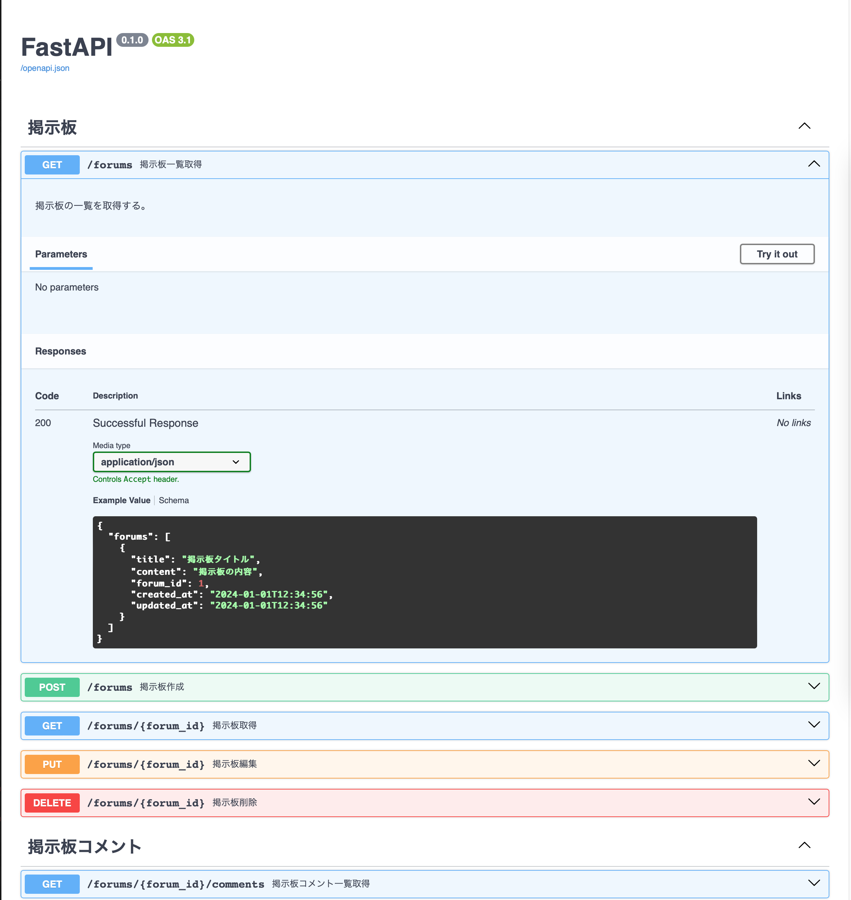
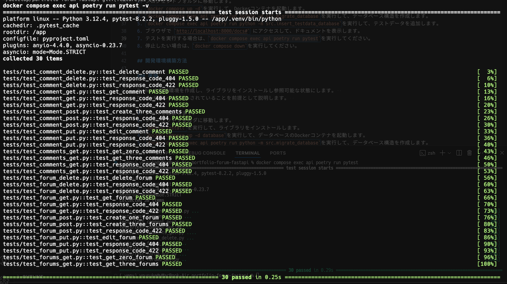

# ポートフォリオ用のFastAPIで作成したAPI

## 概要

Docker環境で実行可能なFastAPIで作成したAPIです。

## 使用技術

- Python
- FastAPI
- Docker
- SQLAlchemy
- MySQL
- Poetry

## デモ

### 自動生成ドキュメント

### 自動テストの実行

## 動作確認方法

Docker環境で動作確認可能です。  

### Docker環境

Dockerを利用して実行する場合は、以下の手順で動作確認できます。  
Dockerがインストールされていることを前提として説明します。

1. シェルを起動します。
2. プロジェクトフォルダに移動します。
3. `docker compose up -d`を実行して、Dockerコンテナを起動します。
4. `docker compose exec api poetry run python -m src.migrate_database`を実行して、データベース構造を作成します。
5. `docker compose exec api poetry run python -m src.insert_testdata_database`を実行して、テストデータを追加します。
6. ブラウザで `http://localhost:8000/docs#` にアクセスして、ドキュメントを表示します。
7. 自動テストを実行する場合は、`docker compose exec api poetry run pytest`を実行してください。
8. 停止したい場合は、`docker compose down`を実行してください。

## 開発環境構築方法

### 準備

Pythonの仮想環境を作成し、ライブラリをインストールし参照可能な状態にします。  
Poetryがインストールされていることを前提として説明します。  

1. シェルを起動します。
2. プロジェクトフォルダに移動します。
3. `poetry install`を実行して、ライブラリをインストールします。
4. `docker compose up -d database`を実行して、データベースのDockerコンテナを起動します。
5. `docker compose exec api poetry run python -m src.migrate_database`を実行して、データベース構造を作成します。
